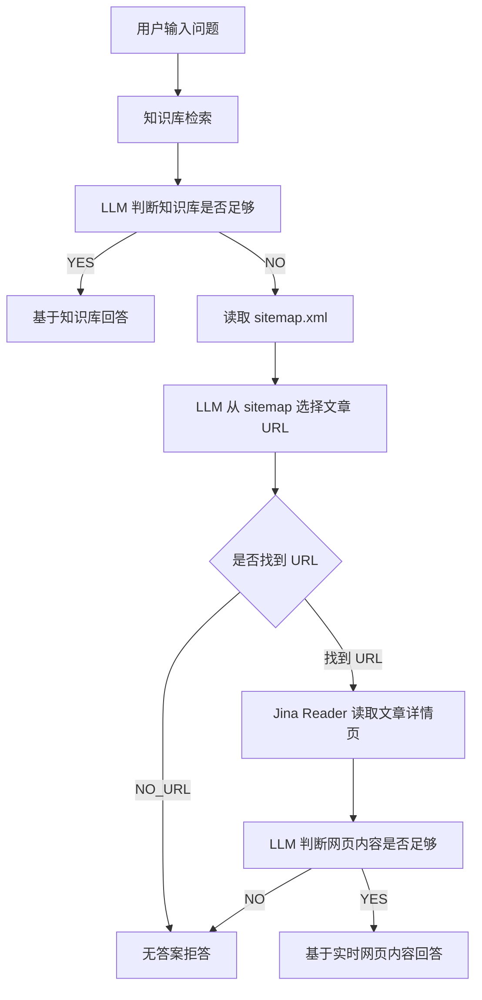

# WebKnow：准实时网站知识库问答助手
 
> 核心能力：**知识库 RAG 优先回答 + sitemap 准实时补充 + Jina Reader 网页读取 + 无答案拒答**。

---

## 1. 项目背景

很多个人博客、文档站、企业官网都有大量内容，但用户很难快速找到答案。普通站内搜索只能匹配关键词，无法理解用户意图；普通 RAG 知识库问答又依赖提前导入的内容，一旦网站新增文章或知识库漏抓页面，就可能答不上来。

因此，本项目设计了一个准实时网站知识库问答助手：

1. 用户先向网站助手提问。
2. 系统优先从 Dify Knowledge 知识库中检索内容。
3. 如果知识库结果足够，直接基于知识库回答。
4. 如果知识库不足，系统读取网站 `sitemap.xml`。
5. LLM 从 sitemap 中选择最相关的站内文章 URL。
6. Jina Reader 实时读取文章详情页正文。
7. 系统再基于实时网页内容回答。
8. 如果知识库和站内页面都没有明确答案，则拒答，避免幻觉。

---

## 2. 产品定位

**WebKnow** 是一个面向博客、文档站、企业官网和知识型网站的准实时问答助手。

它不是单纯的知识库机器人，而是一个带有多层兜底能力的网站问答产品：

```text
第一层：知识库 RAG
第二层：sitemap 站内内容发现
第三层：Jina Reader 实时网页读取
第四层：无答案拒答
```

适用场景：

- 个人博客 AI 问答助手
- 企业官网客服问答
- 产品文档问答
- 内部知识库问答
- 教程站点内容导航助手

---

## 3. 核心功能

| 功能 | 说明 |
|---|---|
| 知识库优先回答 | 用户提问后，优先检索 Dify Knowledge |
| 检索结果判断 | 使用 LLM 判断知识库结果是否足够回答 |
| sitemap 补充 | 知识库不足时读取站点 sitemap |
| URL 选择 | 从 sitemap 中选择最可能相关的文章详情页 URL |
| 实时网页读取 | 通过 Jina Reader 获取文章正文 Markdown |
| 内容有效性判断 | 判断实时抓取内容是否足够回答 |
| 无答案拒答 | 站内无内容时明确拒答，降低幻觉 |
| 来源引用 | 回答末尾提供参考来源 |
| badcase 记录 | 记录误判、误拒答、合规风险等问题 |

---

## 4. 系统流程



---

## 5. 技术栈

| 模块 | 工具 |
|---|---|
| 工作流编排 | Dify Chatflow |
| 知识库 | Dify Knowledge |
| 网页读取 | Jina Reader |
| 内容发现 | sitemap.xml |
| 条件判断 | LLM 判断节点 + 条件分支 |
| URL 清洗 | Dify 代码执行节点 |
| 回答生成 | LLM |
| 部署方式 | Dify WebApp / 网站嵌入 |

---

## 6. 当前版本

### V1.5：知识库优先 + sitemap 实时补充

当前版本已经实现：

- 知识库 RAG 问答
- 知识库不足判断
- sitemap 页面读取
- 相关文章 URL 选择
- Jina Reader 实时读取文章详情页
- 实时内容回答
- 无答案拒答
- 10 条测试用例与 badcase 分析

后续版本计划见：[docs/ROADMAP.md](docs/ROADMAP.md)

---

## 7. 测试结果概览

本项目设计了 10 条测试用例，覆盖知识库命中、实时网页补充、跨概念对比、操作类问答、合规风险和无答案拒答等场景。

| 类型 | 数量 | 结果 |
|---|---:|---|
| 知识库直接回答 | 3 | 通过 |
| sitemap + Jina 实时补充 | 4 | 通过 |
| 无答案拒答 | 1 | 通过 |
| 需优化 badcase | 2 | 已记录优化方向 |

详细测试记录见：[docs/TEST_CASES.md](docs/TEST_CASES.md)

---

## 8. 主要 badcase

测试过程中发现了 3 类典型问题：

1. **相关性误判**  
   检索结果只包含泛 AI 内容，但判断节点误判为可回答。

2. **操作类问题误拒答**  
   知识库中存在相关操作内容，但判断节点过于严格，导致误判为无答案。

3. **合规风险**  
   平台违规、账号封禁、风控类问题中，模型可能给出规避平台规则的建议。

详细分析见：[docs/BADCASE_REPORT.md](docs/BADCASE_REPORT.md)

---

## 9. 项目亮点

从 AI 产品经理视角，本项目重点体现：

- 能将真实用户问题拆解为产品流程。
- 能设计 RAG 问答链路，而不是只写单条 Prompt。
- 能设计知识库命中、实时补充、无答案拒答三种路径。
- 能用测试集评估 AI 应用效果。
- 能发现 badcase，并提出可执行优化方案。
- 能处理回答边界、合规风险和幻觉控制问题。

---

## 10. 仓库结构

```text
WebKnow/
├── README.md
├── docs/
│   ├── PRD.md
│   ├── ARCHITECTURE.md
│   ├── TEST_CASES.md
│   ├── BADCASE_REPORT.md
│   ├── PROMPTS.md
│   ├── METRICS.md
│   ├── ROADMAP.md
│   └── INTERVIEW_PITCH.md
├── workflow/
│   └── WebKnow-dify-chatflow.yml
├── screenshots/
│   └── .gitkeep
└── demo/
    └── demo_video_link.md
```

---

## 11. 使用说明

1. 在 Dify 中导入 `workflow/WebKnow-dify-chatflow.yml`。
2. 配置 Dify Knowledge 知识库。
3. 配置 Jina Reader 工具。
4. 将 sitemap 地址替换为你的网站地址。
5. 测试知识库命中、实时补充和无答案拒答三条路径。
6. 发布为 WebApp，嵌入到网站中。

---

## 12. 简历项目描述

```text
WebKnow：准实时网站知识库问答助手
- 基于 Dify Chatflow 设计网站问答助手，构建“知识库 RAG 优先 + sitemap 实时补充 + Jina Reader 网页读取”的多层回答流程。
- 设计 LLM 判断节点，对知识库检索结果、sitemap URL、实时网页正文进行有效性判断，实现知识库命中、实时补充和无答案拒答三种路径。
- 使用 Jina Reader 将站内网页转换为 Markdown，并通过 sitemap 定位相关文章，实现知识库未命中场景下的准实时站内内容补充。
- 设计 10 条测试用例，覆盖知识库命中、跨概念对比、站内实时补充、操作类问答、合规风险和无答案拒答等场景。
- 通过 badcase 分析优化 Prompt 规则，降低泛相关误判、操作类误拒答和平台规则规避类回答风险。
```
