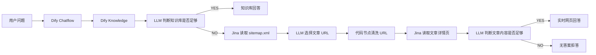

# 系统架构说明

## 1. 架构目标

WebKnow 的架构目标是解决普通 RAG 知识库更新不及时、漏抓页面无法回答、模型容易编造的问题。

系统采用三层回答路径：

```text
第一层：知识库 RAG
第二层：sitemap + Jina Reader 实时补充
第三层：无答案拒答
```

---

## 2. 总体架构



---

## 3. 节点说明

### 3.1 用户输入节点

接收用户问题，核心变量：

```text
query = 用户输入的问题
files = 用户上传的文件，当前版本暂不使用
```

### 3.2 知识检索节点

作用：使用 `query` 检索 Dify Knowledge。

配置建议：

```text
Top K：3-5
Score Threshold：0.2-0.5
Retrieval Mode：Hybrid 优先
```

### 3.3 知识库判断 LLM

作用：判断检索结果是否足够回答。

输出：

```text
YES / NO
```

### 3.4 条件分支 1

```text
如果判断结果为 YES → 知识库回答
否则 → sitemap 补充
```

### 3.5 读取 sitemap

作用：读取站点 sitemap，例如：

```text
https://murraytsai.github.io/sitemap.xml
```

### 3.6 URL 选择 LLM

作用：从 sitemap 中选择最相关的文章详情页 URL。

过滤规则：

```text
不要选择 /tags/
不要选择 /categories/
不要选择 /archives/
不要选择 /page/
不要选择 /about/
不要选择 /links/
```

### 3.7 代码执行节点

作用：清洗 LLM 输出的 URL，去除大括号、引号、多余空格、Markdown 代码块等。

### 3.8 读取文章详情页

作用：使用 Jina Reader 读取真正文章正文。

### 3.9 实时内容判断 LLM

作用：判断文章正文是否足够回答用户问题。

输出：

```text
YES / NO
```

### 3.10 最终回答节点

根据知识库内容或实时文章内容回答用户。

---

## 4. 为什么不用完全实时搜索？

完全实时搜索的问题：

- 响应慢。
- 成本更高。
- 结果不稳定。
- 容易搜到首页、标签页、分类页。

所以本项目采用：

```text
知识库优先，实时补充兜底
```

---

## 5. 为什么使用 sitemap？

sitemap 是网站自己的页面清单，相比联网搜索更稳定。它可以帮助系统从站内范围寻找可能相关的文章，避免搜索到站外内容。

---

## 6. 当前限制

- LLM 可能在判断节点中误判相关性。
- sitemap 过大时，URL 选择成本会增加。
- 中文 URL 可能导致来源链接过长。
- 如果网页正文需要前端渲染，Jina 可能抓取不完整。
- 当前版本未自动写回知识库。
